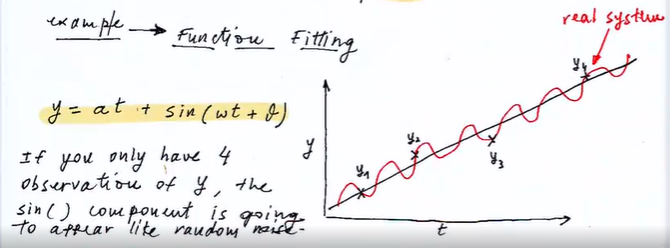
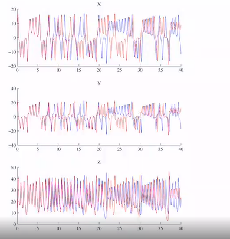
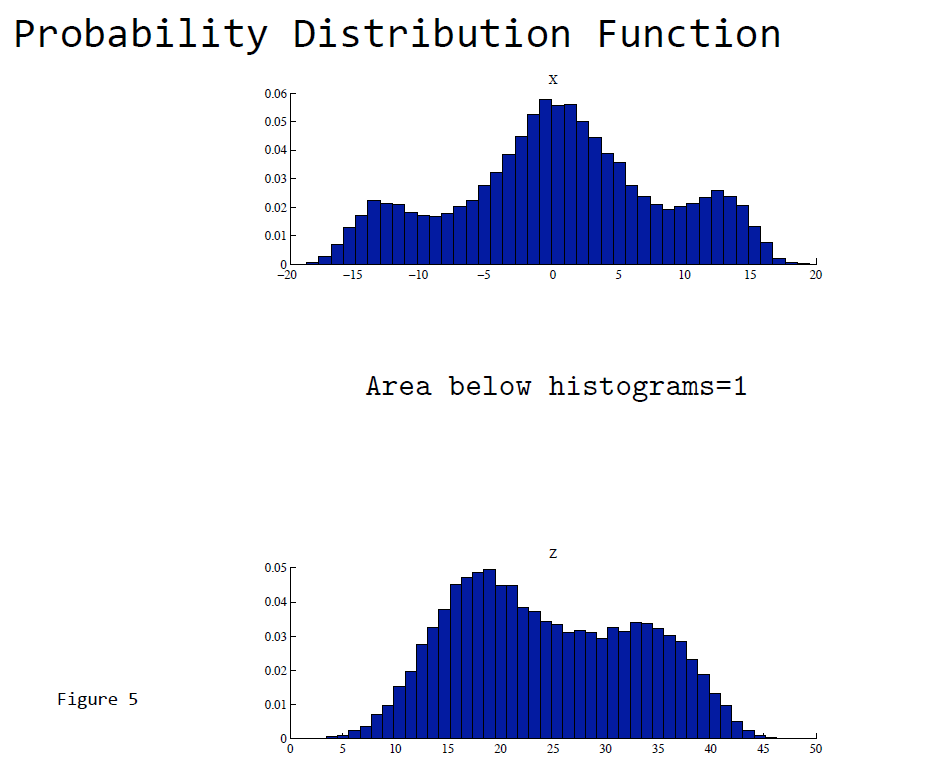

# data analysis
## course 01

### overall
1. part two of the course is hard
    * how to combine the observational data with the theoretical model
2. part three is about forcasting and extrapolation（外推）
    * linear model
    * nonlinear model
3. signal decomposition
dimensionality reduction
    * eof
    * pca
    * machine learning
    * ...

### topics01 why statistics?

assumption: all environmental variable are controlled by a large **deterministic** system

properties
1. system is complex
    * more degrees of freedom than one can observe
        * thus the system will appar to be "non-deterministics" and introduce a "random" component
        * if you have a deterministic system, then you could write down a set of dynamical equations to describe the evolution of the system
        * 
        in this example, $sin$ function acts as a "random" component 
          
2. system is nonlinear
    * variable could not be studied in isolation
        * ENSO should couple ocean and atmosphere together

3. dynamics are often unpredictable
    * small changes in initial condition $ O(\varepsilon)$ would lead to order 1 $O(1)$ changes in the state of the system at future times
    * note: **unstable linear system are alos unpredictable**

three variable

blue and red curve have great difference in trajectories while they only have $O(\varepsilon)$ difference in initial time, which tells us:
1. small changes in $X$ initial conditions leas to dramatic differences in future state
2. variable $Y$ studied in isolation apeears to develop random fluctuations even though a time zero both the red and blue system have exact the same state, which suggests a nonlinear correlation between $X$ AND $Y$

chaos

lorenz attractor

* nonliear determinidtic system
    * nonliear term such as $XZ$ and $XY$
    * question: how to desrcibe the system
        * phase space diagram   
          

            1. this system only have three varible thus it is easy to plot the phase space diagram while in the real case of weather, it may have millions of freedom.
            2. the trajectory of the state in phase space collapses around the attractor!
    * assume we could not observe $Y$ 
    
    * PDF of the variable
        
        1. in nature, PDF of most of the environmental data have te shape of Gaussian distribution becasue of the central limit theory.
        2. However, for a nonliear system, the shape is non-gaussian
        3. **Note**: most of the statistics that you would learn is based on the assumption that 
    

